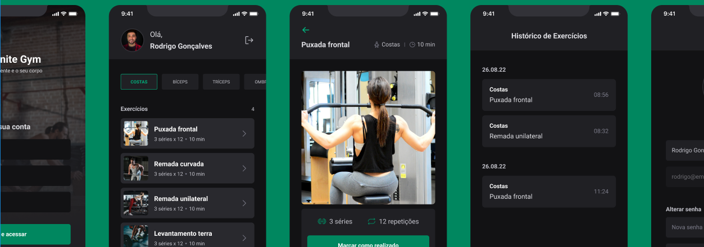

## Description

Ignite Gym is a workout application developed during Rocketseat's Next Level Week 3. This app empowers users to create and track their exercises, connect with like-minded fitness enthusiasts, monitor their progress over time, and find motivation and support from fellow users who share their fitness interests.

## Features

Ignite Gym offers a comprehensive set of features designed to enhance your fitness journey:

- **Create and Track Exercises:** Users can easily create and track their exercises, helping them stay consistent and achieve their fitness goals.

- **Connect with Other Users:** Ignite Gym enables users to find and connect with others who share their passion for fitness, fostering a supportive community.

- **Progress Monitoring:** The app allows users to visually track their progress over time, helping them see their improvements and stay motivated.

- **Motivation and Support:** Users can receive motivation and support from the community, making the fitness journey more enjoyable and successful.

- **Diverse Workout Options:** Ignite Gym provides access to a variety of exercises and workout plans, catering to different fitness preferences.

## Technologies Used

The Ignite Gym app was developed with cutting-edge technologies to provide a seamless user experience:

- **Form Validation:** The app implements robust form validations using React Hook Form in conjunction with the Yup library, ensuring accurate data entry.

- **Profile Photo Upload:** Users can upload their profile photos, personalizing their experience within the app.

- **User Profile Management:** Ignite Gym offers the flexibility to change usernames and passwords, allowing users to customize their profiles as needed.

- **Token-Based Authentication:** The app employs token-based authentication for secure access, ensuring user data remains private.

- **Backend Service:** The app relies on a backend service designed specifically for Ignite Gym. This backend service is hosted on a local server, providing seamless functionality.

## Developed with:

- 
- 
- 
